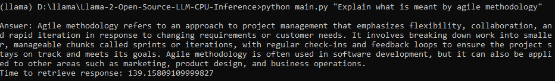

# Running Llama 2 and other Open-Source LLMs on CPU Inference Locally for Document Q&A

## Context

- Third-party commercial large language model (LLM) providers like OpenAI's GPT have democratized LLM use via simple API calls.
- However, there are instances where teams would require self-managed or private model deployment for reasons like data privacy and residency rules.
- In this project, we will discover how to run quantized versions of open-source LLM Llama2 by Meta on local CPU inference for document question-and-answer (Q&A).
    

---

## Quickstart

- Ensure you have downloaded the GGML binary file from https://huggingface.co/TheBloke/Llama-2-7B-Chat-GGML and placed it into the `models/` folder
- To start parsing user queries into the application, launch the terminal from the project directory and run the following command:
  `python main.py "<user query>"`
- For example, `python main.py "What is meant by agile methodology?"`
- (The PDF used for Querying is Software-Engineering-9th-Edition-by-Ian-Sommerville. You can change the dataset to any pdf file you want.)
    
  

---

## Files and Content

- `/assets`: Images relevant to the project
- `/config`: Configuration files for LLM application
- `/data`: Dataset used for this project (i.e., Software-Engineering-9th-Edition-by-Ian-Sommerville - 790-page PDF document)
- `/models`: Binary file of GGML quantized LLM model (i.e., Llama-2-7B-Chat)
- `/src`: Python codes of key components of LLM application, namely `llm.py`, `utils.py`, and `prompts.py`
- `/vectorstore`: FAISS vector store for documents
- `db_build.py`: Python script to ingest dataset and generate FAISS vector store
- `main.py`: Main Python script to launch the application and to pass user query via command line
- `pyproject.toml`: TOML file to specify which versions of the dependencies used (Poetry)
- `requirements.txt`: List of Python dependencies (and version)

---

## References

- https://github.com/marella/ctransformers
- https://huggingface.co/TheBloke
- https://huggingface.co/TheBloke/Llama-2-7B-Chat-GGML
- https://python.langchain.com/en/latest/integrations/ctransformers.html
- https://python.langchain.com/en/latest/modules/models/llms/integrations/ctransformers.html
- https://python.langchain.com/docs/ecosystem/integrations/ctransformers
- https://ggml.ai
- https://github.com/rustformers/llm/blob/main/crates/ggml/README.md
- https://www.mdpi.com/2189676
